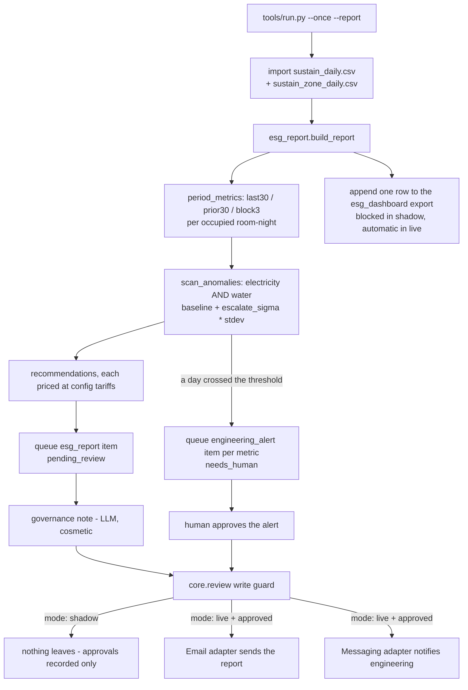

# Sustainability Reporting AI — "The Ranger"

Tracks energy, water, waste, and laundry volumes per occupied room, benchmarks month over month, drafts the ESG report sections, and flags anomalies (a spike in water use on floor 3) to engineering.

## What it does

Tracks energy, water, waste, and laundry volumes per occupied room, benchmarks month over month, drafts the ESG report sections, and flags anomalies (a spike in water use on floor 3) to engineering.

**What it won't do.** Reports and flags; it doesn't control building systems. Data quality depends on the meters and invoices it's given.

**Why it matters.** Sustainability reporting is becoming mandatory for groups and a rate-winning badge for corporate RFPs - and today it's a spreadsheet nightmare.

**What to expect.** Per-property consumption dashboards and audit-ready ESG report drafts.

That last line is the roster's own promise, and this template is upfront
about where it goes further than the demo it was extracted from: the demo's
own data model had no laundry column and could only ever report the whole
property, never a floor. Both gaps are closed here - see
`docs/how-it-works.md` → "Design decisions" for exactly what changed and why.

## Who it's for

- **Any hotel or small group with metered utilities** - electricity, water,
  waste and laundry, whatever granularity your meters and invoices give you.
  No restaurant assumption, no PMS brand assumption; everything arrives as a
  CSV export.
- **Groups where sustainability reporting is becoming mandatory**, and
  independent hotels who want the badge for a corporate RFP without hiring
  someone to build the report by hand every month.
- **Properties with per-floor or per-zone sub-metering** get the most out of
  the anomaly detector - it can name the floor. Properties without it still
  get a genuine anomaly scan, just reported at the property level.
- **Replaces:** the monthly spreadsheet exercise of pulling meter reads,
  computing per-room figures by hand, and writing up what changed - the
  "spreadsheet nightmare" the roster names directly.
- **Not for:** a hotel that wants the agent to adjust the BMS, throttle a
  meter, or take any action on a building system. It never does, and there
  is no code path that could - see [§11](#guardrails--safety).

## How it works



**Deterministic decisioning, LLM for language.** Every number in the report
is arithmetic over rows in your meter table - the model is asked for exactly
one thing, a 2-3 sentence closing governance note, and that note never
changes what the report says or what gets flagged. See
`docs/how-it-works.md` for the full formulas and every place this build
differs from the demo it was extracted from.

**The two modes.**

| Mode | What happens |
|---|---|
| `shadow` (default) | The report and any engineering alert are drafted and queued, never sent. The dashboard export is blocked too. |
| `live` | An **approved** report or alert is actually sent the next time you run the send command. The dashboard export happens automatically every run - it is a log, not a message to a person. |

**The review loop.** A report queues as `pending_review`; a genuine anomaly
queues an `engineering_alert` as `needs_human` - a flat month queues none.
`python3 tools/review.py list` shows both. See [§9](#run-it).

**What runs when.**

| Job | Cadence (default) | Config key | Provider |
|---|---|---|---|
| Monthly ESG Report | monthly, on meter-read close | `schedule.esg_report` | LLM only for the cosmetic governance note |

`make schedule ARGS="--all"` prints a cron/launchd/systemd snippet - see
[§9](#run-it).

## What you need

- **A monthly meter export**: electricity (kWh), water (m3), waste (kg),
  laundry (kg), and occupied room-nights, one row per day. A spreadsheet
  export is fine. `docs/integrations.md` names the exact columns.
- **Per-zone or per-floor sub-metering, if you have it** - optional, but it
  is what lets an anomaly be named to a floor instead of just the property.
- **Your own utility tariffs** (price per kWh/m3/kg) - without them the
  report still runs on the shipped example prices, but the euro figures
  will not be yours.
- **A mailbox** to send the report from (or use the mock adapter and read
  `data/exports/sent_email.jsonl` while you are testing).
- **A messaging channel for engineering alerts** - a webhook URL is enough
  to start (Zapier/Make/n8n/Slack-via-webhook).
- **A Claude Code subscription** (what you are reading this in) or your own
  `ANTHROPIC_API_KEY` - only used for one cosmetic sentence a month, so
  either is plenty.
- **Time:** 5 minutes for the quick start below, no credentials. 20-30
  minutes to connect your first real meter export and see a real report.

## Quick start (5 minutes, no credentials)

```bash
git clone https://github.com/th1-ai/sustainability-reporting-ai.git sustainability-reporting-ai
cd sustainability-reporting-ai
make setup
make demo
```

`make setup` creates a virtualenv, installs dependencies, and copies
`.env.example` → `.env` and every `config/*.example.yaml` →
`config/*.yaml`. `make demo` seeds the bundled fixtures (an invented
property, "Hotel Aurora", 90 days of meter reads) and runs the Monthly ESG
Report. You should see something like this (exact figures come from the
fixtures, not hand-typed):

```
Seeded fixtures:
  sustain_daily: 90 row(s)
  sustain_zone_daily: 3 row(s)

[info ] dashboard export blocked reason=blocked: sheets_write — mode is shadow (the global kill-switch), so nothing is sent or written
  -> Review the draft with `make review`; your approve / edit / r
Monthly ESG Report: drafted, queued for review (1 engineering alert(s)).

Review queue:
  needs_human: 1
  pending_review: 1

2 item(s) waiting on a human. Run `make review` to see them.

1 items processed, 1 drafted, 0 sent (shadow)
DEMO OK
```

Nothing was sent anywhere - `mode: shadow` is the default and `make demo`
never changes it. The one engineering alert is a genuine single-day water
spike the fixtures name to "Floor 3" - the roster's own example, working
end to end. Look at what got queued:

```bash
make review
python3 tools/review.py show <id>
```

`make demo` runs against its own database, `data/demo/demo.db`, and
re-imports the bundled fixtures fresh every time - never `data/agent.db`
(that's `make run`'s file) and never a real `data/imports/*.csv` you may
already have connected. The two can never mix in either direction, and
`make demo` is always safe to re-run. `make clean` (see [§9](#run-it))
resets both if you ever want a blank slate.

## Set up with Claude Code

Open `claude` in this folder for each phase below and paste the prompt.
Each one names the workflow file Claude will follow, so you can read ahead
if you want to.

**Phase 1 — first run.**

> Read `workflows/00-setup.md` and walk me through it. I want to see
> `make demo` work before we touch any real data.

**Phase 2 — the property and the tariffs.**

> Follow the "Fill in the property" and "Put your own tariffs in" steps in
> `workflows/00-setup.md`. Ask me for the hotel's name, currency, room
> count, and what we actually pay per kWh, per m3 of water, per kg of
> waste and per kg of laundry.

**Phase 3 — connect your first real meter export.**

> Read `docs/integrations.md`. I have a [utility bill export / BMS export /
> spreadsheet] with daily electricity, water, waste, laundry and occupancy
> - help me get it into the right CSV shape and saved to
> `data/imports/sustain_daily.csv`, then run `make doctor` to confirm it is
> picked up.

**Phase 4 — run it for real.**

> Follow `workflows/10-esg-report.md` to run the report against my real
> data, then walk me through `workflows/80-review.md` to review what it
> produced.

**Phase 5 — per-zone sub-metering, if we have it.**

> I have per-floor or per-zone electricity/water reads. Help me shape them
> into `data/imports/sustain_zone_daily.csv` per `docs/integrations.md`, so
> an anomaly gets named to a floor instead of just the property.

**Phase 6 — go live.**

> Read `workflows/90-go-live.md` and tell me honestly whether we are ready.
> Do not flip `mode` to `live` until you have walked me through the
> checklist and I have said yes.

## Connect your systems

Full detail, exact CSV columns and the "implement your own" recipe live in
`docs/integrations.md`. Short version:

| System | Adapter | Status | Needs |
|---|---|---|---|
| Meter export | `data/imports/sustain_daily.csv` | universal | a daily electricity/water/waste/laundry/occupancy export |
| Per-zone sub-metering (optional) | `data/imports/sustain_zone_daily.csv` | universal | a per-floor/per-zone electricity/water export, if you have one |
| Email — `systems.email.adapter` | `mock` / `imap` / `gmail` | universal / universal / built | a mailbox, or nothing to test with `mock` |
| Messaging — `systems.messaging.adapter` (engineering alerts) | `mock` / `unipile` / `webhook` | universal / built / universal | a webhook URL is the fastest way to start |
| Consumption dashboard — `systems.sheets.adapter` | `csv` / `google` | universal / built | nothing / a service account JSON |
| PMS — `systems.pms.adapter` | configured, not used by the core loop | — | occupied room-nights come from the CSV, not a live PMS call - see the PMS section of `docs/integrations.md` |

Test any of it:

```bash
make doctor
```

`mock` is what `make demo` uses and needs nothing. The CSV path is where
every hotel starts for the meter data - it works with any BMS, any meter
vendor, any spreadsheet export.

## Run it

```bash
python3 tools/run.py --once            # only if the monthly job is due, per config/agent.yaml: schedule:
python3 tools/run.py --once --report   # force the Monthly ESG Report now
python3 tools/run.py --once --dry-run  # compute everything, no business data written
python3 tools/run.py --watch           # loop on poll_seconds (default 86400s = daily check)
```

**The review queue.**

```bash
python3 tools/review.py list                                  # everything waiting
python3 tools/review.py list --kind esg_report
python3 tools/review.py list --kind engineering_alert --status needs_human
python3 tools/review.py show <id>
python3 tools/review.py approve <id>
python3 tools/review.py edit <id> --body-file my-version.txt
python3 tools/review.py reject <id> --reason "..."
python3 tools/review.py send                                  # email the report, notify engineering for alerts
```

Full walkthroughs: `workflows/10-esg-report.md`, `workflows/80-review.md`.

**Scheduling.** `config/agent.yaml`'s `schedule:` block has one entry -
`esg_report`, cadence `monthly` - with a `cadence:` and `command:`:

```bash
make schedule                            # the job's snippet
make schedule ARGS="--all"               # the same, for consistency with the rest of the family
make schedule ARGS="--target launchd"    # macOS laptop
make schedule ARGS="--target systemd"    # Linux box or VPS
```

Nothing is installed automatically - the snippet is printed for you to
paste into `crontab -e`, `launchctl`, or `systemctl`.
`scheduler/crontab.example` shows exactly what `make schedule ARGS="--all"`
produces.

**Subscription vs. API.** This agent makes at most one LLM call a month
(the cosmetic governance note) - your Claude Code subscription
(`llm.provider: claude-code` or `interactive`) is more than enough. See
`docs/safety.md` for the honest tradeoffs.

**Resetting.**

```bash
make clean   # delete runtime state: data/agent.db, data/demo/, data/logs/,
             # data/exports/, data/pending/. config/, .env, and
             # data/imports/ (your imported meter CSVs) are all kept.
```

Use it any time you want a blank slate - after trying `make demo`, after a
bad test import, or before connecting real data for the first time.
`data/agent.db` (your real reports and decisions) and `data/demo/demo.db`
(the fixtures database) are separate files, so `make clean` is the only
thing that touches both; neither file can ever contaminate the other.
Your `data/imports/*.csv` meter exports are never deleted by `make clean` -
they are a hotel's own data, built by hand from utility bills or a BMS
export, and `make demo` never reads them anyway. To drop those too, run
`rm -rf data/imports` yourself.

## Go live

`workflows/90-go-live.md` has the full checklist. In short: real meter data
connected, your own tariffs in `config/agent.yaml`, a real report through
the review queue, a real mailbox and a real messaging channel configured,
recipients set - then:

```yaml
# config/hotel.yaml
mode: live
```

An approved report now actually sends the next time
`python3 tools/review.py send` runs; an approved engineering alert now
actually notifies engineering the same way; the consumption dashboard
export now happens automatically every run (it is not gated by approval -
see `docs/safety.md`). Nothing about sending is automatic - every report
and every alert still needs a human's approval first, exactly as in
shadow. Go back to shadow at any moment by flipping `mode` back, or
`AGENT_MODE=shadow` in `.env` for one run.

## Guardrails & safety

**"Reports and flags; it doesn't control building systems."** Structurally
true, not just policy - there is no write path to a BMS, a meter, or any
building system anywhere in this codebase. Every write that does exist
(email, staff message, dashboard export) goes through `core/review.py`'s
single write guard. `mode: shadow` is a global kill switch; nothing leaves
while it is on. Full detail in `docs/safety.md`.

**Never does:**
- Control a building system, or write to anything that could.
- Invent a meter reading, a tariff, or a zone name it cannot see - an
  anomaly is only named to a floor when `data/imports/sustain_zone_daily.csv` actually
  has rows for that date; otherwise the report says so plainly.
- Present the estimated emissions figure as a meter reading - it is printed
  under its own "Estimated" heading, structurally separate from the metered
  consumption table.
- Show a "saving" that is really a regression - every recommendation's
  impact is floored at zero.
- Claim GRI/CSRD/GSTC/Green Key/EU Taxonomy compliance - this is a utility
  review with a priced action list, not a mapped disclosure filing.
- Send while `mode: shadow`, or send anything nobody approved.

**Data handling.** No guest data passes through this agent at all - the
data model is meter readings and occupancy counts, nothing else. Only a
short summary of the report's own numbers ever reaches a model, for the
cosmetic governance note. Everything is stored locally in `data/agent.db`,
gitignored, no telemetry. There is no guest-facing text anywhere in this
agent, so the EU AI Act Article 50 guest-disclosure line the rest of this
family carries does not apply here - full discussion in `docs/safety.md`.

## Sub-agents in this repo

None. This agent has no children - see `docs/sub-agents.md` for why the
per-zone/per-floor breakdown that makes the roster's "spike in water use on
floor 3" example possible is a data source (`data/imports/sustain_zone_daily.csv`), not a
sub-agent with its own queue. If you run more than one property, the
cross-property comparison job is **Portfolio Analyst AI**, not this repo -
`docs/sub-agents.md` says how the two connect.

## Customising

- **`config/agent.yaml`'s `tariffs:` block.** Every euro figure in the
  report is priced here - `elec_per_kwh`, `water_per_m3`, `waste_per_kg`,
  `laundry_per_kg`, `grid_kgco2_per_kwh`. Put your own numbers in from your
  utility invoices.
- **`config/agent.yaml`'s `anomaly:` block.** `flag_sigma`/`escalate_sigma`
  control how far above baseline a day has to be to get flagged, and
  `rules.esg-anomaly: false` turns the whole scan off (the report says so
  plainly when you do).
- **`config/agent.yaml`'s `report:` block.** `water_target_cut`,
  `laundry_target_cut` and `waste_benchmark_per_room_kg` drive three of the
  four priced recommendations - see `tools/esg_report.py`.
- **`prompts/governance-note.md`** - the only prompt in this repo. Edit the
  tone, the length, or the facts it is allowed to mention. The schema in
  `prompts/schemas/governance-note.json` caps it at 600 characters.
- **A different reporting period.** `build_report` in `tools/esg_report.py`
  slices three fixed 30-day blocks; a rolling 7-day view or a
  same-month-last-year comparison is a natural, self-contained addition -
  `sustain_daily` already holds the history for it once you feed it more
  than 90 days.
- **A framework mapping.** If your group needs GRI/CSRD/GSTC/Green Key/EU
  Taxonomy fields, ask your Claude session to add a mapping layer on top of
  `EsgReportResult` - the underlying numbers are all already computed, this
  repo just does not attempt the mapping itself. See
  `docs/how-it-works.md` "Design decisions" #8.
- **A savings ledger.** `docs/benefits.md` says exactly what to add to turn
  "proposed savings" into "proven savings."

## Troubleshooting & FAQ

**`make demo` does not print `DEMO OK`.** Make sure `make setup` ran first.
`tools/demo.py` calls `load_settings(demo=True)`, which forces the mock LLM
provider and mock adapters regardless of `config/hotel.yaml` - if it still
fails, the bug is in the fixtures or the engine, not your config. This
"regardless of config" promise covers the data too, not just the provider:
`make demo` writes to its own `data/demo/demo.db` and only ever reads the
bundled fixtures, even once you have connected real `data/imports/*.csv` -
see [§6](#quick-start-5-minutes-no-credentials) and [§9](#run-it).

**The report says "nothing to report".** `data/imports/sustain_daily.csv`
is empty or missing. See [§8](#connect-your-systems).

**Every anomaly finding says "not being surfaced".** The `esg-anomaly` rule
is off in `config/agent.yaml`. Turn it back on.

**An anomaly isn't named to a zone.** `data/imports/sustain_zone_daily.csv` has no rows
for that date, or does not exist. Optional, and the report says so honestly
instead of guessing - see [§8](#connect-your-systems).

**Why doesn't the CSV dashboard export need approval like the report
does?** By design - it is a log of numbers already in the report, not a new
message to a person. It is still fully blocked in shadow mode. See
`docs/safety.md`.

Full list, with every error message this repo can print:
`workflows/99-troubleshooting.md`.

## Measuring the benefit

Track the roster's own numbers with:

```bash
make report
```

Shows, per run: the period, the anomaly count, whether the dashboard export
went out, the human edit rate on the report, engineering-alert outcomes,
and the utility-cost-per-room trend against the roster's `-9%` target.

**Honest caveat.** "Proposed vs. what actually happened" is a comparison,
not proof of causation - nothing here ties a specific recommendation to a
later change in the meter data. See `docs/benefits.md` for exactly what a
rigorous savings ledger would add.

Full detail, what each metric tells you, and every honest caveat:
`docs/benefits.md`.

## About

Built by [TH1](https://th1.ai) - AI agents for independent hotels. This
repo is a template: clone it, run it on your own data, on your own Claude
Code subscription or API key. Nothing here talks to TH1's infrastructure.

Want it run for you instead of running it yourself?
[th1.ai](https://th1.ai) sets up, tunes and manages this agent (and the
rest of the family) for hotels who would rather not.

Licence: MIT, see `LICENSE`.

**Changelog.**
- v1 - initial release: Monthly ESG Report with per-30-day-block
  normalisation, baseline+sigma anomaly detection for electricity and water
  (with optional per-zone naming), four priced recommendations, a labeled
  Scope 2 emissions estimate, and a consumption dashboard export. No
  sub-agents.
