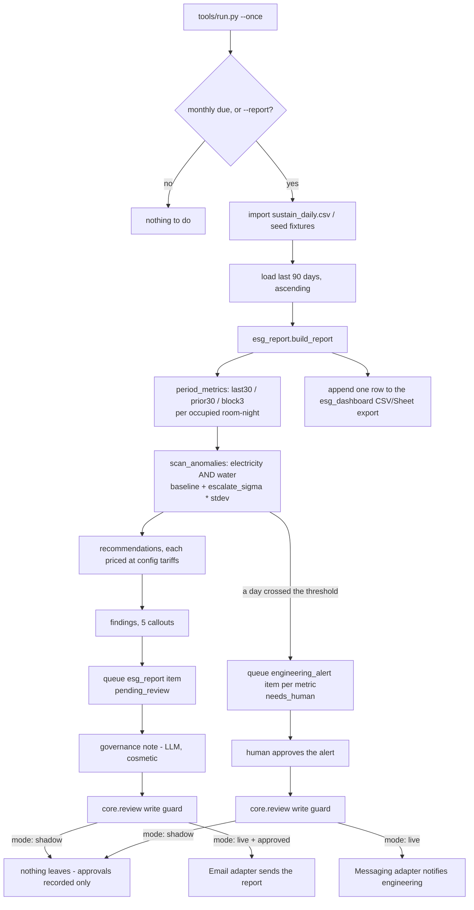

# How Sustainability Reporting AI works

One job, fully deterministic decisioning, with the LLM used for exactly one
cosmetic line of prose. Every number in the report is arithmetic over rows in
the meter table — nothing is guessed, and nothing is estimated except the one
section that says plainly that it is an estimate.

## The job

| Job | Runs | Reads | Writes (gated) |
|---|---|---|---|
| **Monthly ESG Report** | Monthly, on meter-read close | `sustain_daily` (90 days), optional `sustain_zone_daily` | an `esg_report` item, `pending_review`; "email the report" sends it |
| Anomaly escalation (part of the same run) | Same run, only when a day crosses the baseline | the same 90 days | one `engineering_alert` item per flagged metric, `needs_human`; "notify engineering" sends a staff message |

There is no second job and no folded-in sub-agent — see `docs/sub-agents.md`
for why a per-zone breakdown is a data source, not a sub-agent.

The only LLM call is a 2-3 sentence governance note appended to the report,
`prompts/governance-note.md`. It never changes a figure, a finding or a
recommendation; if the call fails, or the provider is `interactive` (see
"Why the note is skipped, not paused" below), the run still completes with the
note left blank.

## Flow

## Modes

- `mode: shadow` (default): the report is drafted and queued; an anomaly
  alert is drafted and queued. Neither the report email nor the engineering
  notification ever leaves the machine.
- `mode: live`: an approved `esg_report` item is emailed when a human runs
  `python3 tools/review.py send`. An approved `engineering_alert` item
  notifies engineering the same way. A gate always beats send — see
  `docs/safety.md`.

## What runs when

| Workflow | Cadence (default) | Config key | Provider |
|---|---|---|---|
| Monthly ESG Report | monthly, `schedule.esg_report` | `schedule.esg_report` | LLM only for the governance note |

`make schedule ARGS="--all"` prints the cron/launchd/systemd snippet — see
`workflows/00-setup.md`.

## Data model

This agent's own tables, created by `Store.migrate()` in `tools/store_ext.py`:

- `sustain_daily` — the meter table: `date` (primary key), `kwh`, `water_m3`,
  `waste_kg`, `laundry_kg`, `occupied_rooms`. One row per day, one property.
  Loaded from `data/imports/sustain_daily.csv` automatically before every
  report pass — see `docs/integrations.md`.
- `sustain_zone_daily` — **optional** per-zone electricity and water reads
  (`id`, `date`, `zone`, `kwh`, `water_m3`). When present for the date an
  anomaly was flagged, the report names the zone ("Floor 3 accounted for
  61% of that day's electricity"). When absent, the report says plainly
  that no per-zone sub-metering is connected — see "Design decisions" #2.
- `sustain_runs` — one row per report run (`kind = 'esg'`), with a
  `stats_json` summary and the governance note. Read by `tools/report.py`.
- `sustain_recommendations` — one row per recommendation ever issued
  (`period_label`, `title`, `impact_eur`, `metric`), so a later run can show
  whether the cost-per-room trend actually moved after a recommendation was
  made. See "Design decisions" #10 (the ROI ledger).

The `items` table (core) carries two kinds: `esg_report` (the drafted report,
follows the ordinary draft → review → send path) and `engineering_alert`
(the anomaly escalation, follows the same path but sends a staff message
instead of an email).

## Idempotency

- `esg_report`: one item per period (`unique_key = period_label`,
  `store.upsert_unique("esg_report", period_label, ...)`). Re-running the
  same month returns the existing item instead of drafting a second one.
- `engineering_alert`: one item per `(metric, date)` of the flagged day —
  re-running the same window never duplicates an alert for the same spike.
- Nothing increments a sequence or writes an export on a `--dry-run` pass.
- The alert item is only created **after** the deterministic scan has fully
  resolved (there is no interactive stage in this agent that can pend
  mid-scan — the only LLM call is the cosmetic note, appended after both
  items already exist), so there is no "marker written before a pause"
  hazard here — see `factory/workflows/build-repo.md` §2 for why that
  ordering matters in agents that do have an interactive decision stage.

## Design decisions (where the spec was silent, or the demo and the roster's
own promise disagreed)

The behavioural spec (`specs/sustainability-reporting-ai.md`) extracted from
the demo platform lists twelve open questions in its section 11. This build
resolves the ones that make a real difference to a hotel using this repo, and
says plainly where it still falls short of "audit-ready ESG report" in the
full compliance sense.

1. **Laundry is in the roster promise, absent from the demo's data model.**
   The demo's `esg_daily` table has no laundry column. This template adds
   `laundry_kg` to `sustain_daily` from day one, with its own KPI tile,
   finding and priced recommendation — the roster says "energy, water,
   waste, and laundry volumes per occupied room" and this build now tracks
   all four.

2. **"A spike in water use on floor 3" needs per-zone sub-metering the demo
   never had.** `sustain_zone_daily` is optional: when a hotel's BMS or
   sub-meters export zone-level reads, the anomaly finding names the zone.
   When it does not, the finding says exactly that ("no per-zone
   sub-metering is connected") instead of pretending the property-level
   figure is a zone figure. This is the "when a data source is not
   connected, the agent says so" rule applied to the single biggest gap
   between the roster's own example and the demo's build.

3. **The anomaly detector is a baseline, not a maximum.** The demo engine
   returns the highest-electricity day in the window unconditionally — there
   is always an "anomaly," even on a flat series. `tools/esg_report.py`'s
   `scan_anomalies()` instead flags any day whose per-room reading exceeds
   `mean + escalate_sigma * population_stdev` (the same shape as the F&B
   till audit's void-watch baseline in the reporting-audit-ai family
   sibling), and returns an empty list — genuinely no anomaly — when no day
   crosses it. `anomaly.flag_sigma` / `anomaly.escalate_sigma` in
   `config/agent.yaml` control the threshold.

   The dollar figure in the matching "Find what ran on the spike days"
   recommendation (`recommend_spike()`) is priced from that same per-room
   baseline, converted back to raw units at the flagged day's own occupancy
   - never from the property-wide absolute mean. A low-occupancy day can
   have a per-room reading that is a genuine outlier while its absolute
   reading sits at or under the property's usual absolute mean; pricing the
   "excess" against the absolute mean would then round to zero and the
   report would show a correctly-flagged spike next to "0.0 kWh above an
   average day... 0.00 [currency] per year" - contradicting its own alert.

4. **Water is now scanned for anomalies too**, not only electricity. The
   demo detects spikes on electricity and separately complains that water
   "has not moved" without ever checking whether a single day drove that.
   The same `scan_anomalies()` function runs once per metric.

5. **Tariffs are per-property config, not module constants.**
   `config/agent.yaml: tariffs:` (`elec_per_kwh`, `water_per_m3`,
   `waste_per_kg`, `laundry_per_kg`) replaces the demo's hard-coded prices.
   If you also run **Reporting & Audit AI** against the same property, keep
   its water tariff (used when it challenges a utility invoice) in sync with
   this one by hand — the two repos do not share state.

6. **Annualising a recommendation's saving uses the trailing 90-day average
   occupancy, not one month's room-nights times 12.** The demo's
   `annualRoomNights = last30.rooms * 12` flattens a single month across a
   full year, which is a real error at a seasonal property.
   `annual_room_nights()` instead averages daily occupied rooms across the
   full 90-day window before annualising — still an approximation with only
   90 days of history, but not a single month's snapshot presented as a
   year.

7. **A labeled Scope 2 CO2e estimate is included, kept structurally separate
   from the metered figures.** The Method callout's "no estimates" claim
   covers consumption and cost, which are reproducible from the meter table.
   The emissions line uses a configurable grid factor
   (`tariffs.grid_kgco2_per_kwh`, default an EU-average 0.233 kgCO2e/kWh —
   **replace it with your own grid operator's published figure**) and is
   printed under its own "Estimated emissions (Scope 2, location-based)"
   heading, never mixed into the metered table. This is not a Scope 1/3
   inventory and does not attempt one.

8. **No GRI / CSRD / GSTC / Green Key / EU Taxonomy field mapping.** This
   report is, honestly, a well-argued utility review with a priced action
   list — exactly what the roster's `cant` line says: "reports and flags."
   Mapping this data onto a specific disclosure framework's required fields
   is real, framework-specific work a hotel's Claude session can do once
   you tell it which framework applies to you; `docs/benefits.md` says where
   to start.

9. **One property per clone, not a portfolio dashboard.** The roster's
   "per-property dashboards" is plural; this repo, like every repo in this
   family, runs one property. Cross-property comparison is
   **Portfolio Analyst AI**'s job, not this repo's — see that repo if you
   run more than one property. `tools/esg_report.py:export_dashboard_rows()`
   writes one row per period in a format a group ESG team can concatenate
   across properties by hand or with that agent.

10. **A savings ledger, so "-9% utility cost per occupied room" is checkable,
    not just proposed.** `sustain_recommendations` logs every recommendation
    issued (period, title, priced impact). `tools/report.py` compares the
    cumulative proposed savings against the actual month-over-month change
    in `cost_per_room` and prints both — an honest "proposed vs. what
    actually happened" line, not a claim that the recommendation caused the
    change. See `docs/benefits.md`.

11. **Waste is priced directly, no separate ledger table.** The demo has an
    unused `waste_log` table that duplicates what the tariff already prices.
    This build prices waste once, in `sustain_daily`, at `tariffs.waste_per_kg`.

12. **The report is actually sent and exported now**, not confined to a
    browser session. `esg_report` items go through the ordinary
    draft → review → send path to a mailbox; `export_dashboard_rows()`
    appends to a CSV/Sheets export every run, so "per-property consumption
    dashboards" is a file you can open, not a demo-only chart.

## Why the governance note is skipped, not paused, on the `interactive`
provider

The governance note is cosmetic — it never gates a decision, changes a
number, or changes which findings appear. Pausing every monthly report run
on a human answering a writing prompt would make the one non-deterministic
part of this agent the only thing standing between "the report is ready" and
"the report is stuck," for no decision-quality reason. So `get_governance_note()`
returns `None` outright when the effective provider is `interactive`
(never raising `LLMPendingInteractive`), the same choice this family's
Reporting & Audit AI made for its controller's note. Every other provider
(`mock`, `claude-code`, `anthropic`) calls the model as normal, and a failure
there is swallowed the same way — the run always completes, with or without
the note. `tests/test_sustainability_run.py` asserts the note is skipped, not
paused, on `interactive`.

## Money and units

Every human-facing figure — the report body, review-queue labels, `make
demo` output, `tools/report.py` — is formatted with `fmt_money()` in
`tools/esg_report.py`, which reads `settings.hotel.currency`. Nothing here
hard-codes "EUR" or "€"; `tests/test_sustainability_report.py` builds the
report for a GBP hotel and checks the currency code appears, not a euro
sign.
